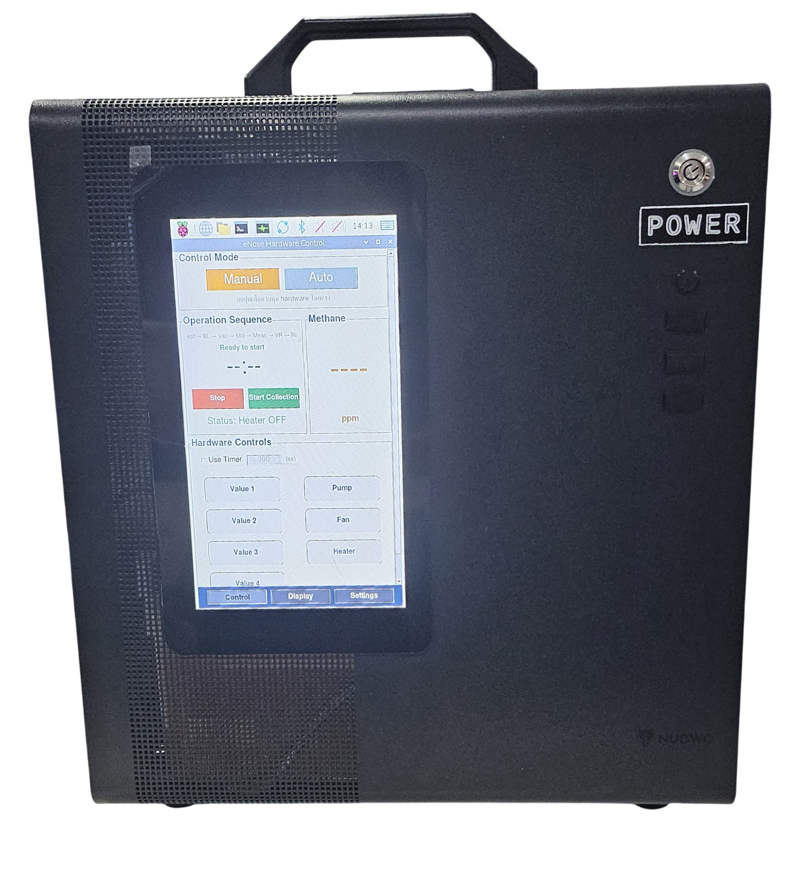

# eNose Methane Detection System

Raspberry Pi–based **electronic nose (eNose)** for estimating methane (CH₄) concentration in **ppm**, using MOS gas sensors, automated sampling, and machine learning.

ระบบควบคุมและเก็บข้อมูลจาก eNose บน Raspberry Pi — อ่านสัญญาณเซ็นเซอร์ก๊าซผ่าน ADS1263 + สภาพแวดล้อมจาก BME280 ประมวลผลเป็น CSV แล้วประมาณค่ามีเทนด้วยโมเดล ML แสดงบน GUI

<p align="center">
  
  
</p>

**เป้าหมาย:** มอนิเตอร์มีเทนแบบต้นทุนต่ำ (เช่น บริบทนาข้าว) เป็นทางเลือกเสริมวิธีอ้างอิงอย่าง chamber–GC

> ค่า ppm จากโมเดลเป็นค่าประมาณจากการสอบเทียบ ML — ไม่ใช่ค่ามาตรฐานรับรองทางกฎหมาย

---

## Features

- **GUI** — 3 หน้า: Control / Display / Settings (Tkinter)
- **Manual & Auto modes** — ควบคุมรีเลย์ด้วยมือ หรือรันลำดับ 7 Operations อัตโนมัติพร้อม Loop
- **Data acquisition** — ADS1263 (~100 Hz, หลายช่อง) + BME280 (T/H/P, ~10 Hz) → `.npz`
- **Signal processing** — Low-pass IIR + Moving Average → `.csv`
- **Methane prediction (ppm)** — Linear Regression (`models/methane_linreg_model.joblib`)
- **Cloud upload (optional)** — Google Drive (Service Account) พร้อมคิว retry
- **Autostart** — เปิด GUI หลัง boot บน Raspberry Pi

## Hardware

| ส่วน | รายละเอียด |
|------|------------|
| Controller | Raspberry Pi (SPI / I2C / GPIO) |
| Gas ADC | ADS1263 (SPI) — เซ็นเซอร์ MOS เช่น TGS2611 |
| Environment | BME280 (I2C) — อุณหภูมิ ความชื้น ความดัน |
| Actuators | 7× relay (Active HIGH): วาล์ว ×4, pump, fan, heater |

## Quick start

### Requirements

- Raspberry Pi + Python 3.x (หรือ PC โหมดจำลอง)
- Dependencies: ดู `requirements-pi.txt` (core/viz แยกได้) และ `requirements-cloud.txt` (ถ้าใช้ Drive)

### Install (Raspberry Pi)

```bash
sudo apt-get update
sudo apt-get install -y python3-tk python3-numpy python3-pandas python3-matplotlib
sudo apt-get install -y python3-rpi.gpio python3-spidev

python3 -m venv .venv
.venv/bin/python -m ensurepip --upgrade
.venv/bin/python -m pip install -r requirements-pi.txt
.venv/bin/python -m pip install scikit-learn joblib
```

### Run GUI

```bash
bash program/run_gui.sh
# หรือ
cd program && python3 gui.py
```

ต้องมีจอ Desktop / VNC (`$DISPLAY`) — ดูรายละเอียดในเอกสารด้านล่าง

### Sync code to Pi

```bash
# Linux / macOS / Git Bash
./scripts/sync_to_pi.sh pi@raspberrypi.local ~/eNose_methane

# PowerShell
.\scripts\sync_to_pi.ps1 -Remote "pi@raspberrypi.local" -Dest "~/eNose_methane"
```

## Project structure

```
eNose_methane/
├── program/              # GUI + hardware_config / cloud_config
├── reading/              # ADS1263 + BME280 → reading/data/*.npz
├── acquisition/          # Filter → acquisition/processed_data/*.csv
├── hardware_control/     # GPIO relay controller
├── cloud/                # Google Drive upload (optional)
├── models/               # Deployed ML model (.joblib)
├── predict_methane.py    # Feature extract + predict_ppm()
├── BuildML_PC/           # Train / export model (PC / Colab)
├── scripts/              # sync_to_pi
├── docs/                 # User guide, manuscript, papers
└── tests/                # Cloud queue / uploader tests
```

## Documentation

| Document | Audience |
|----------|----------|
| [User guide](docs/user-guide/eNose-User-Guide.md) ([PDF](docs/user-guide/eNose-User-Guide.pdf)) | ผู้ปฏิบัติงานบนเครื่อง |
| [Autostart setup](program/AUTOSTART_SETUP.md) | ผู้ดูแลระบบ Pi |
| [Docs index](docs/README.md) | Manuscript / literature |
| [ML training (Colab)](BuildML_PC/train/colab/) | ผู้เทรนโมเดลบน PC |

### Config cheat sheet

| ไฟล์ | ใช้ทำอะไร |
|------|-----------|
| `program/hardware_config.json` | เวลาแต่ละ Op, GPIO, loop |
| `reading/main.py` | ช่อง ADC, sample rate |
| `reading/bme280.py` | I2C address, sample rate |
| `acquisition/acquisiton.py` | cutoff / moving-average window |
| `program/cloud_config.json` | Google Drive (คัดลอกจาก `cloud_config.example.json`) |

## Pipeline (สั้นๆ)

1. **Collect** — Auto/Manual เริ่มเก็บ ADC + BME → `.npz`
2. **Process** — `process_all_data()` → low-pass + MA → `.csv`
3. **Predict** — `predict_ppm()` จากช่วง Baseline/Measure → แสดง ppm บน GUI
4. **Upload (optional)** — `.npz` + `.csv` → Google Drive

**Auto Mode (7 ops):** Heating → Baseline *(เริ่มเก็บข้อมูล)* → Vacuum → Mix Air → Measure → Vacuum Return → Recovery → Break → วนซ้ำ

## Model note

โมเดล Linear Regression ถูกเทรนนอก Pi แล้ว deploy ที่ `models/`. เมตริกอ้างอิงจาก `models/methane_linreg_metrics.json` (GroupKFold OOF โดยประมาณ R² ≈ 0.74, RMSE ≈ 1.8 ppm — อัปเดตตามรอบเทรนล่าสุด)

เทรนใหม่: ดู notebook ใน `BuildML_PC/train/colab/`

## License & authorship

ส่วนหนึ่งของงานวิจัย eNose สำหรับการตรวจจับก๊าซมีเทน

**Author:** eNose Project
