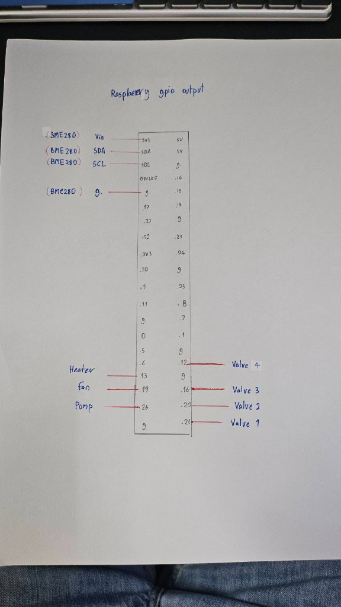
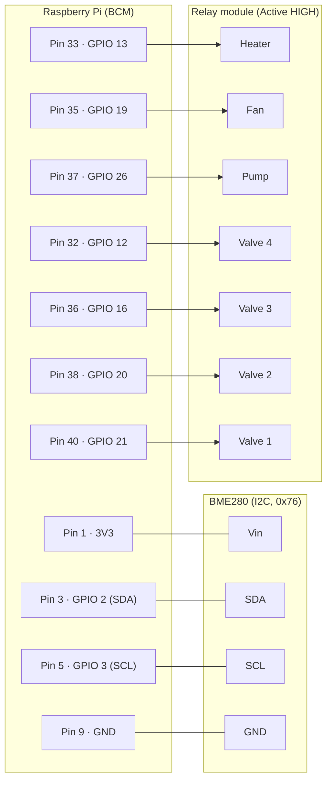

# Raspberry Pi GPIO Pinout — eNose Methane

เอกสารอ้างอิงการต่อสาย (wiring reference) ระหว่าง Raspberry Pi กับฮาร์ดแวร์ของระบบ eNose Methane
ที่ใช้ในโปรเจกต์นี้ ครอบคลุมเซ็นเซอร์สิ่งแวดล้อม BME280 (I2C) และรีเลย์ควบคุมอุปกรณ์ 7 ตัว
(โซลีนอยด์วาล์ว 4 ตัว, ปั๊ม, พัดลม, ฮีตเตอร์) ผ่าน GPIO

**ผู้อ่านเป้าหมาย:** ผู้ที่ประกอบ/บำรุงรักษาเครื่อง eNose บน Raspberry Pi
**ผู้ที่ไม่ใช่ผู้อ่านเป้าหมาย:** ผู้พัฒนา ML / วิเคราะห์ข้อมูล (ดู `README.md` หลัก)

> หมายเลข pin ทั้งหมดในเอกสารนี้ใช้ระบบ **BCM numbering** (เลข GPIO ของชิป) — ตรงกับโค้ดที่ตั้ง
> `GPIO.setmode(GPIO.BCM)` ใน `hardware_control/hardware.py` คอลัมน์ "Header pin" คือเลขช่อง
> ตามตำแหน่งทางกายภาพบน 40-pin header (1–40)

## ภาพต้นฉบับ



## ที่มาของ pin mapping

ค่าทั้งหมดในตารางด้านล่างถูกเก็บไว้ในไฟล์คอนฟิกหลัก และจะถูกโหลดโดย `HardwareController`
ที่ runtime หากต้องการเปลี่ยน pin ให้แก้ที่ไฟล์เดียวคือ `program/hardware_config.json`

```13:20:program/hardware_config.json
    "gpio_pins": {
        "s_valve1": 21,
        "s_valve2": 20,
        "s_valve3": 16,
        "s_valve4": 12,
        "pump": 26,
        "fan": 19,
        "heater": 13
    },
```

```27:35:hardware_control/hardware.py
_DEFAULT_GPIO_PINS = {
    "s_valve1": 21,
    "s_valve2": 20,
    "s_valve3": 16,
    "s_valve4": 12,
    "pump": 26,
    "fan": 19,
    "heater": 13
}
```

## สรุปการเชื่อมต่อ

### 1) BME280 (I2C) — เซ็นเซอร์อุณหภูมิ/ความชื้น/ความดัน

| ขา BME280 | สัญญาณ      | GPIO (BCM) | Header pin | หมายเหตุ                                   |
| --------- | ----------- | ---------- | ---------- | ------------------------------------------ |
| `Vin`     | 3V3 Power   | —          | **1**      | ห้ามต่อ 5V — BME280 ของบอร์ดส่วนใหญ่รับ 3V3 |
| `SDA`     | I2C1 SDA    | GPIO 2     | **3**      | ใช้กับ `busio.I2C(board.SCL, board.SDA)`   |
| `SCL`     | I2C1 SCL    | GPIO 3     | **5**      | —                                          |
| `GND`     | Ground      | —          | **9**      | ใช้ GND ใดก็ได้บน header                   |

I2C address เริ่มต้นในโค้ดคือ `0x76` (ปรับเป็น `0x77` ตาม jumper บนบอร์ดได้ที่
`BME_I2C_ADDRESS` ใน `reading/bme280.py`)

### 2) Relay control — อุปกรณ์ 7 ตัว

> รีเลย์ในระบบนี้เป็นแบบ **Active HIGH** ตามที่ใช้งานจริงใน `hardware.py`
> (`GPIO.HIGH` = ON, `GPIO.LOW` = OFF) — โปรดตรวจสอบโมดูลรีเลย์ของคุณก่อนต่อ
> ถ้าโมดูลที่ใช้เป็น Active LOW ให้กลับ logic ใน `HardwareController.control_device()`

| อุปกรณ์         | คีย์ใน config | GPIO (BCM) | Header pin |
| --------------- | -------------- | ---------- | ---------- |
| Solenoid Valve 1| `s_valve1`     | GPIO 21    | **40**     |
| Solenoid Valve 2| `s_valve2`     | GPIO 20    | **38**     |
| Solenoid Valve 3| `s_valve3`     | GPIO 16    | **36**     |
| Solenoid Valve 4| `s_valve4`     | GPIO 12    | **32**     |
| Pump            | `pump`         | GPIO 26    | **37**     |
| Fan             | `fan`          | GPIO 19    | **35**     |
| Heater          | `heater`       | GPIO 13    | **33**     |

ทุกอุปกรณ์ใช้ GND ร่วม (แนะนำ pin 34 หรือ 39 ใกล้กับกลุ่ม pin ที่ใช้งาน เพื่อสายเรียบขึ้น)

## ตำแหน่งบน 40-pin header

แผนผังด้านล่างแสดงเฉพาะ pin ที่ระบบ eNose ใช้งานจริง (อิงตามภาพต้นฉบับ)
ส่วน pin อื่นปล่อยว่างไว้

```
                 ┌──────────────────────┐
   3V3  Pin  1 ──┤ ●  BME280 Vin    ●   ├── Pin  2  5V
GPIO 2  Pin  3 ──┤ ●  BME280 SDA    ●   ├── Pin  4  5V
GPIO 3  Pin  5 ──┤ ●  BME280 SCL    ●   ├── Pin  6  GND
        Pin  7 ──┤ ●                ●   ├── Pin  8
   GND  Pin  9 ──┤ ●  BME280 GND    ●   ├── Pin 10
        Pin 11 ──┤ ●                ●   ├── Pin 12
        Pin 13 ──┤ ●                ●   ├── Pin 14  GND
        Pin 15 ──┤ ●                ●   ├── Pin 16
        Pin 17 ──┤ ●                ●   ├── Pin 18
        Pin 19 ──┤ ●                ●   ├── Pin 20  GND
        Pin 21 ──┤ ●                ●   ├── Pin 22
        Pin 23 ──┤ ●                ●   ├── Pin 24
        Pin 25 ──┤ ●  GND           ●   ├── Pin 26
        Pin 27 ──┤ ●                ●   ├── Pin 28
        Pin 29 ──┤ ●                ●   ├── Pin 30  GND
        Pin 31 ──┤ ●                ●   ├── Pin 32  GPIO 12 → Valve 4
GPIO 13 Pin 33 ──┤ ●  Heater        ●   ├── Pin 34  GND
GPIO 19 Pin 35 ──┤ ●  Fan           ●   ├── Pin 36  GPIO 16 → Valve 3
GPIO 26 Pin 37 ──┤ ●  Pump          ●   ├── Pin 38  GPIO 20 → Valve 2
        Pin 39 ──┤ ●  GND           ●   ├── Pin 40  GPIO 21 → Valve 1
                 └──────────────────────┘
```

## ไดอะแกรมการเชื่อมต่อ (Mermaid)



## การตรวจสอบหลังต่อสาย

1. **ตรวจ I2C** — บน Pi รัน:

   ```bash
   sudo i2cdetect -y 1
   ```

   ต้องเห็น `76` (หรือ `77`) ตรงตาราง

2. **ตรวจ relay** — รันสคริปต์ทดสอบของ `HardwareController` โดยตรง:

   ```bash
   python3 hardware_control/hardware.py
   ```

   จะเปิด/ปิดอุปกรณ์ทีละตัว และพิมพ์สถานะออกทาง stdout

3. **ตรวจจาก GUI** — รัน `program/gui.py` แล้วใช้ **Manual Mode** กดเปิด/ปิด
   ทุกอุปกรณ์ดูทีละตัวก่อนเข้า Auto Mode

## ความสัมพันธ์กับโค้ด

| สิ่งที่กำหนด                | ไฟล์                                   |
| --------------------------- | -------------------------------------- |
| แมป GPIO ทั้งระบบ           | `program/hardware_config.json`         |
| โหลด/ตั้งค่า GPIO + Relay    | `hardware_control/hardware.py`         |
| อ่าน BME280 ผ่าน I2C         | `reading/bme280.py`                    |
| ลำดับการเปิด/ปิดใน Auto Mode | `AUTO_OPERATION_STEPS` ใน `program/gui.py` |

หากเปลี่ยน pin ในเอกสารนี้ ให้แก้ที่ `program/hardware_config.json` เท่านั้น —
โค้ดจะอ่านค่าใหม่อัตโนมัติเมื่อเริ่มโปรแกรมครั้งถัดไป
