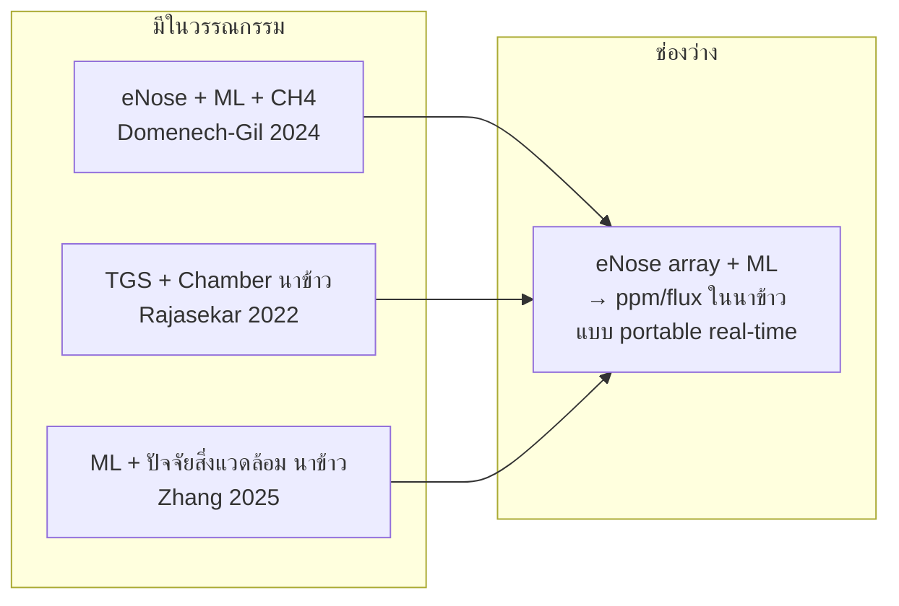

# Literature Review: การประยุกต์ใช้จมูกอิเล็กทรอนิกส์ ร่วมกับการเรียนรู้ของเครื่องในการประเมินปริมาณก๊าซมีเทนในนาข้าว

> **ช่วงอ้างอิง:** 2021–2026  
> **แหล่งหลัก:** [`docs/paper/`](.) (27 PDF + metadata stubs)  
> **วิธีค้นหาเพิ่มเติม:** Firecrawl Research (`firecrawl research search-papers`, `related-papers`, `inspect-paper`)  
> **workflow:** `firecrawl-research-papers`

---

## บทคัดย่อ

นาข้าวเป็นหนึ่งในแหล่งปล่อยก๊าซมีเทน (CH₄) จากกิจกรรมมนุษย์ที่สำคัญ โดยเฉพาะในเอเชียตะวันออกเฉียงใต้และ Monsoon Asia การประเมิน **flux** หรือ **ความเข้มข้น** CH₄ ในภาคสนามยังพึ่งพาวิธี chamber, eddy covariance หรือเครื่องมืออ้างอิงราคาสูง ทำให้การติดตามแบบความถี่สูงและต้นทุนต่ำยังท้าทาย [14], [15], [19]

ในทศวรรษล่าสุด **จมูกอิเล็กทรอนิกส์ (electronic nose, eNose)** ที่ใช้ **sensor array** แบบ metal oxide semiconductor (MOS) ร่วมกับ **machine learning (ML)** ถูกพัฒนาเพื่อจำแนกและ **quantify** ก๊าซ รวมถึง CH₄ ในสภาพแวดล้อม [1], [3], [7] อย่างไรก็ตาม จากการสำรวจใน `docs/paper/` และ Firecrawl Research **ยังไม่พบงานวิจัย peer-reviewed ที่รวมทั้งสามองค์ประกอบ — eNose + ML + การประเมิน CH₄ ในนาข้าว — ในงานเดียว** งานที่ใกล้เคียงที่สุดแยกเป็น (ก) eNose+ML สำหรับ CH₄ ทั่วไป [1], [9] และ (ข) เซ็นเซอร์ต้นทุนต่ำ+chamber ในนาข้าว [2], [13]

รีวิวนี้สังเคราะห์สามกระแสงานวิจัยที่ต้องบูรณาการ: (1) กลไกและปัจจัยควบคุม CH₄ จากนาข้าว (2) สถาปัตยกรรม eNose/MOS สำหรับมีเทน (3) อัลกอริทึม ML สำหรับ calibration และ regression จากสัญญาณเซ็นเซอร์ แล้วอภิปรายช่องว่างทางวิจัยที่สอดคล้องกับโปรเจกต์ eNose Methane (TGS2612 array, BME280, Auto sequence Baseline–Measure, Linear Regression)

---

## 1. บริบท: การเกิดและการวัด CH₄ จากนาข้าว

### 1.1 นาข้าวเป็นแหล่ง CH₄ สำคัญ

การปลูกข้าวในสภาพน้ำท่วมขังสร้างสภาพแบบ **anaerobic** ที่เอื้อต่อ **methanogenesis** ทำให้นาข้าวเป็นแหล่งปล่อย CH₄ ระดับภูมิภาคและโลก [14] Zhou et al. (2024) สรุปว่าข้าวเป็นอาหารหลักของมากกว่าครึ่งหนึ่งของประชากรโลก และ ~90% ผลิต/บริโภคในเอเชีย โดยเน้นความจำเป็นในการประมาณ emission ระดับภูมิภาคและมาตรการลดการปล่อย

ปัจจัยที่ควบคุมการปล่อย CH₄ ได้แก่ **ระดับน้ำ/การจัดการน้ำ** (continuous flooding vs alternate wetting and drying, AWD), ปุ๋ยไนโตรเจน, ชนิดพันธุ์ข้าว, คุณสมบัติดิน (pH, carbon availability, redox) และลักษณะราก/rhizosphere [15], [17], [18], [19]

### 1.2 ความผันผวนและความท้าทายในการวัดภาคสนาม

CH₄ จากนาข้าวมี **ความผันผวนสูง** ทั้งตามฤดูกาล ระยะเจริญเติบโตของข้าว และช่วงเวลาในวัน (เช่น ebullition) [stub: diurnal ebullition, 2024] Zhang et al. (2025) ชี้ว่าการติดตาม CH₄ แบบ in-situ ความถี่สูงจากนาข้าวยังท้าทายเพราะ emission ผันผวนและสภาพแวดล้อมซับซ้อน [13]

วิธีวัดมาตรฐาน ได้แก่:
- **Closed chamber + GC/LAS** — ต้นทุนต่ำถึงปานกลาง แต่แรงงานสูง
- **Eddy covariance / micrometeorological** — แม่นยำแต่แพง [15]
- **Process-based models** เช่น CH4MOD — ประมาณระดับ global/regional [16]

แนวโน้มล่าสุดคือ **เซ็นเซอร์หลายตัว + ML + IoT** เพื่อลดต้นทุนและเพิ่มความถี่ [13], [stub: IoT GHG paddy, 2024]

### 1.3 งานสำคัญจาก `docs/paper/methane/`

| งาน | ประเด็นหลัก | ความเกี่ยวข้องกับ eNose |
|-----|-------------|------------------------|
| Zhou et al. (2024) [14] | รีวิว CH₄ นาข้าว Monsoon Asia, mitigation | กำหนดบริบท emission ที่ต้องวัด |
| Zhang et al. (2025) [13] | ML + ปัจจัยน้ำ-ดิน-อากาศ → CH₄ flux, DTR R²=0.84 | แนวคิด fusion สิ่งแวดล้อม+ML ใกล้โปรเจกต์ |
| Anapalli et al. (2023) [15] | AWD ลด CH₄ (eddy covariance) | อ้างอิง mitigation / validation |
| CH4MOD (2025) [16] | โมเดลกระบวนการระดับ global | benchmark การประมาณ emission |
| Water–fertilizer synthesis (2022) [17] | meta-analysis จัดการน้ำ/ปุ๋ย vs CH₄ | ออกแบบ protocol วัด |
| Rice root / rhizosphere (2024) [18] | รากข้าวกับ CH₄ | อธิบาย variability ของสัญญาณ |
| Carbon + soil pH (2025) [19] | กลไกทางดินควบคุม CH₄ | ตัวแปรสิ่งแวดล้อมเสริม |

---

## 2. จมูกอิเล็กทรอนิกส์และเซ็นเซอร์ MOS สำหรับมีเทน

### 2.1 หลักการ eNose

eNose ประกอบด้วย **array ของเซ็นเซอร์ที่มีความเลือกสารบางส่วน (partially selective)** ส่งสัญญาณไปยัง **pattern recognition** เพื่อจำแนกหรือประมาณความเข้มข้นก๊าซ [3], [6] Ye et al. (2021) สรุปว่า ML ทำให้ eNose ทำได้ทั้ง **qualitative** (จำแนกชนิด) และ **quantitative** (ประมาณความเข้มข้น)

เซ็นเซอร์ MOS (เช่น Figaro TGS, TGS2611/2612) มีข้อดีเรื่อง **ต้นทุนต่ำ ขนาดเล็ก** แต่มี **cross-sensitivity** ต่อความชื้น อุณหภูมิ และก๊าซรบกวน [1], [5], [8]

### 2.2 งาน eNose เฉพาะทาง CH₄

**Domènech-Gil et al. (2024)** [1] เป็นงานอ้างอิงหลักที่ใช้ **eNose แบบ low-cost** สำหรับ **environmental methane monitoring**:

- เซ็นเซอร์: TGS2611-C00, TGS2611-E00 (×3) + **BME680** (T, RH, P)
- ML: **Partial Least Squares Regression (PLSR)** พร้อม 10-fold cross-validation
- Features: ค่าเฉลี่ย, slope, FFT จากสัญญาณ TGS
- ผลลัพธ์: RMSE ต่ำสุด **33 ppb**, R² สูงสุด **0.91** ในภาคสนาม; ในห้องปฏิบัติการ R² > 0.9, RMSE < 100 ppb ช่วง 0–9 ppm CH₄
- ข้อจำกัด: ต้องมี **field calibration** กับเครื่องอ้างอิงเป็นระยะ; ความชื้นมีผลแรงกว่า CH₄ บน MOS

งานอื่นใน `docs/paper/enose/` ที่เกี่ยวข้อง:

| อ้างอิง | เนื้อหา |
|--------|---------|
| Dobrzyniewski et al. (2021) [4] | TGS sensor array ติดตามกระบวนการ methane reforming |
| Yin et al. (2023) [5] | eNose 7 เซ็นเซอร์ ระบุ CH₄/CO ในก๊าซผสม |
| Portable semiconductor (2022) [6] | เซ็นเซอร์ semiconductor แบบพกพาสำหรับ CH₄ |
| MOS CH₄ review (2023) [20] | รีวิววัสดุ MOS chemiresistive สำหรับ methane |
| Chemiresistive eNose review (2021) [21] | eNose สำหรับอาหาร/สิ่งแวดล้อม |

### 2.3 งานที่เชื่อม eNose กับนาข้าวโดยตรง

**Rajasekar & Selvi (2022)** [2] เป็นงานใน corpuse ที่ **ใช้เซ็นเซอร์ MOS ในข้าวนาโดยตรง**:

- ระบบ: automatic gas chamber + GAQU (gas accumulator and quantifier)
- เซ็นเซอร์ CH₄: **TGS 2611** และ MQ4 (ไม่ใช่ eNose array แบบหลายช่องพร้อม ML)
- การแปลงค่า: ใช้ **สูตรผู้ผลิต** (Rs/R0) ไม่ใช่ ML regression
- ผล: CIF (controlled intermittent flooding) ลด CH₄ ได้เมื่อเทียบ CF/IF
- **ช่องว่าง:** ไม่ได้ใช้ ML หรือ sensor fusion แบบ eNose; วัด flux ผ่าน chamber ไม่ใช่ ppm โดยตรงจาก breath sample

---

## 3. Machine Learning สำหรับประเมินความเข้มข้น/ปริมาณ CH₄

### 3.1 ML calibration เซ็นเซอร์ต้นทุนต่ำ

| อ้างอิง | วิธี | ผลเด่น |
|--------|------|--------|
| Andrews et al. (2023) [7] | ML calibrate gas sensors สำหรับ methane emissions monitoring | แก้ cross-sensitivity, เหมาะ emission detection |
| Mitchell et al. (2024) [8] | Figaro NGM2611-E13 + ML (peatland) | แสดงศักยภาพ low-cost sensor + ML ภาคสนาม |
| ML indirect quantification (2022) [12] | ML บนเซ็นเซอร์เดียว stationary | indirect quantification จาก infrastructure |

### 3.2 Regression และ deep learning บน sensor array

**Lakhmi et al. (2024)** [9] เปรียบเทียบ **linear vs non-linear** models บน gas sensor array ที่มี **CH₄** เป็นหนึ่งในก๊าซเป้าหมาย — ตรงกับข้อสงคมของโปรเจกต์ที่ใช้ **Linear Regression** ว่าพอเพียงหรือไม่

**Jiang et al. (2024)** [10] เสนอ **TFA-CNN** (time-frequency attention CNN) สำหรับทั้ง classification และ **concentration prediction** บน eNose

**Wang et al. (2024)** [11] ใช้ **GraphCapsNet / GraphANet** ประมาณความเข้มข้นก๊าซผสม ได้ R² > **0.96** บน benchmark datasets

งานอื่น: PCA-ANN (2025) [22], SVM + Sparrow Search (2022) [23], tree-based ML (2024) [24], SMOTE-augmented ML (2024) [25]

### 3.3 ML สำหรับ CH₄ ในนาข้าว (ไม่ใช่ eNose)

**Zhang et al. (2025)** [13] — งานที่ **ใกล้ use case โปรเจกต์ eNose Methane มากที่สุด** ในด้านนาข้าว:

- Input: ปัจจัย **น้ำ-ดิน-อากาศ** ที่วัดได้ด้วยเซ็นเซอร์ (Hpw, EC, Ts, Eh, pH ฯลฯ)
- ML: **Decision Tree Regressor (DTR)** ดีที่สุด (R² = **0.84** ด้วย soil factors)
- ไม่ได้ใช้ MOS/eNose breath sample แต่แสดงว่า **fusion ปัจจัยสิ่งแวดล้อม + ML** ให้ CH₄ inversion ในข้าวนาได้

**Lee et al. (2026)** [26] ใช้ **XGBoost และ Random Forest** ประมาณ CH₄ emission จากนาข้าวในเกาหลีใต้ จากข้อมูล chamber 3 ปี (NSE สูง) — แนว regional ML ไม่ใช่ real-time sensor

---

## 4. การบูรณาการ: eNose + ML + นาข้าว — ช่องว่างและแนวทาง

### 4.1 สรุปช่องว่างทางวิจัย (research gap)



จาก Firecrawl Research และ corpus ใน `docs/paper/`:

1. **ยังไม่มีงานที่รวม eNose (MOS array) + ML regression + การวัด CH₄ ในนาข้าวแบบ end-to-end** ใน publication เดียว
2. งาน eNose+CH₄ ส่วนใหญ่ทำในสิ่งแวดล้อมทั่วไป (wetland, sludge, garden) [1] ไม่ใช่ระบบน้ำขังข้าวโดยเฉพาะ
3. งานนาข้าว+เซ็นเซอร์ [2] ใช้ TGS แต่ **ไม่ใช่ ML pattern recognition** แบบ eNose
4. งาน ML+นาข้าว [13] ใช้ปัจจัยดิน-น้ำ ไม่ใช่ **breath/sample chamber + MOS fingerprint**

### 4.2 ความสอดคล้องกับโปรเจกต์ eNose Methane

| องค์ประกอบโปรเจกต์ | ฐานวิชาการจาก literature |
|-------------------|-------------------------|
| TGS2612 × 4 + BME280 | Domènech-Gil [1]: TGS2611 array + BME; Rajasekar [2]: TGS2611 ในนาข้าว |
| Auto sequence (Baseline → Measure) | Zhang [13]: ช่วงเวลา/สภาพสำคัญ; chamber methods [2], [17] |
| ΔV / slope features + Linear Regression | Lakhmi [9]: linear vs nonlinear; Andrews [7]: ML calibration |
| Static chamber ภาคสนาม | Rajasekar [2]; user guide field protocol |
| แสดงผล ppm บน GUI | Domènech-Gil [1]: ppm–ppb range; Jiang [10], Wang [11]: concentration prediction |

โปรเจกต์จึงอยู่ในตำแหน่ง **บูรณาการ engineering** ที่เชื่อมสามกระแสที่มีอยู่แล้วในวรรณกรรม แต่ยังไม่ถูกรวมในงานวิจัยเดียว — มีความเป็นไปได้ทางวิชาการหากมีการ validate กับ chamber/GC และระบุข้อจำกัด ML

---

## 5. งานวิจัยหลัก (Key Papers)

| # | ผู้แต่ง (ปี) | หัวข้อ | วิธี | ผลสำคัญ | ไฟล์ใน repo |
|---|-------------|--------|------|---------|------------|
| 1 | Domènech-Gil et al. (2024) | eNose environmental CH₄ | TGS2611×3 + BME680, PLSR | R²≤0.91, RMSE 33 ppb | `enose/2024_Domenech-Gil_...pdf` |
| 2 | Rajasekar & Selvi (2022) | GHG sensing rice fields | TGS2611 chamber, manufacturer curve | CIF ลด CH₄ | `methods-field/2022_Rajasekar_...pdf` |
| 3 | Ye et al. (2021) | Smart eNose + ML review | Review | แนวทาง ML ใน eNose | `enose/2021_Ye_...pdf` |
| 7 | Andrews et al. (2023) | ML calibrate CH₄ sensors | ML calibration | emission monitoring | `algorithm/2023_Andrews_...pdf` |
| 9 | Lakhmi et al. (2024) | Linear vs nonlinear array | Regression comparison | CH₄ ใน gas mixture | `algorithm/2024_Lakhmi_...pdf` |
| 11 | Wang et al. (2024) | Graph models concentration | GraphCapsNet/GraphANet | R²>0.96 | `algorithm/2024_Wang_...pdf` |
| 13 | Zhang et al. (2025) | ML CH₄ paddy Yangtze | DTR, water-soil-air | R²=0.84 | `methane/2025_Zhang_ML_in-situ_CH4_measurement_paddy_fields_Yangtze.pdf` |
| 14 | Zhou et al. (2024) | CH₄ Monsoon Asia review | Review | mitigation factors | `methane/2024_Zhou_...md` (stub) |
| 15 | Anapalli et al. (2023) | AWD rice CH₄ | Eddy covariance | AWD ลด emission | `methane/2023_Anapalli_...pdf` |

---

## 6. ประเด็นที่วรรณกรรมเห็นพ้อง (Themes & Consensus)

1. **ต้นทุนต่ำจำเป็น** — chamber/GC/eddy covariance ไม่เหมาะกับเครือข่ายจุดวัดหลายจุด [2], [7], [14]
2. **Cross-sensitivity ของ MOS ต้องแก้ด้วย ML และ/หรือเซ็นเซอร์สิ่งแวดล้อม** (T, RH, P) [1], [8]
3. **การจัดการน้ำ (AWD/CIF) ลด CH₄** จากนาข้าวได้อย่างมีเหตุผล [2], [15], [stub: straw mulching AWD]
4. **ML regression ใช้ได้ทั้ง calibration และ inversion** — ตั้งแต่ PLSR, linear, tree ถึง deep learning [1], [9], [10], [13]
5. **ช่วงเวลา Baseline vs Measure สำคัญ** — สอดคล้องกับ feature engineering แบบ ΔV ในโปรเจกต์

---

## 7. คำถามเปิดและข้อถกเถียง (Open Questions)

1. **Linear Regression เพียงพอหรือไม่?** Lakhmi (2024) [9] และ Wang (2024) [11] ชี้ว่า non-linear/deep models อาจดีกว่าในก๊าซผสม — ต้อง validate บนข้อมูลนาข้าวจริง
2. **ppm จาก eNose vs flux จาก chamber** — Rajasekar [2] วัด flux (mg m⁻² h⁻¹); Domènech-Gil [1] วัด concentration — ต้องชัดเจนว่าโปรเจกต์รายงาน **ppm ในห้องตัวอย่าง** ไม่ใช่ flux โดยตรง
3. **การสอบเทียบกับอ้างอิง** — Domènech-Gil [1] เน้น periodic reference calibration; โปรเจกต์ต้องมี protocol สอบเทียบกับ GC/chamber
4. **การแปลผลจากห้องตัวอย่าง (static chamber) สู่นาข้าวเปิด** — สภาพ RH/อุณหภูมิ/ลมต่างจาก lab
5. **งาน stub 8 เรื่อง** ใน `methane/` ยังไม่มี PDF — ต้องเข้าถึงผ่านสถาบันเพื่ออ้างอิงเต็มรูปแบบ

---

## 8. แนวโน้มล่าสุด (Emerging Trends, 2024–2026)

- **Multi-sensor fusion** (MOS + environmental + soil probes) + ML [1], [13]
- **Deep learning บน time-series** (CNN, graph networks) แทน steady-state features [10], [11]
- **IoT + low-cost networks** สำหรับ GHG ในพื้นที่เกษตร [stub: IoT GHG]
- **Regional ML** (XGBoost/RF) จาก chamber data ระดับจังหวัด/ประเทศ [26]
- **Integration mitigation + monitoring** (AWD, straw mulching) พร้อม quantification [15], [stub: straw mulching]

---

## 9. ข้อจำกัดของรีวิวนี้

- อ้างอิงหลักจาก **abstract + metadata + scrape** ของ Open Access papers; งาน paywalled 8 เรื่องอ่านเต็มไม่ได้ (มีเฉพาะ stub)
- Firecrawl `read-paper` ไม่คืน full-text สำหรับบาง PMC ID — ใช้ `firecrawl scrape` แทน
- **ไม่รวม** patent, grey literature นอก corpus
- ช่วงปีเน้น **2021–2026** แต่มี citation พื้นฐานก่อนหน้าในบทนำของ papers

---

## 10. บรรณานุกรม (References)

รูปแบบ: `[#] Author et al. (Year). Title. *Journal*. DOI. Local: path`

**eNose / sensing**

[1] Domènech-Gil, G., Duc, N. T., Wikner, J. J., Eriksson, J., Påledal, S. N., Puglisi, D., & Bastviken, D. (2024). Electronic Nose for Improved Environmental Methane Monitoring. *Environmental Science & Technology*, 58(1), 352–361. https://doi.org/10.1021/acs.est.3c06945 — `enose/2024_Domenech-Gil_eNose_environmental_methane_monitoring.pdf`

[2] Rajasekar, P., & Selvi, J. A. V. (2022). Sensing and Analysis of Greenhouse Gas Emissions from Rice Fields to the Near Field Atmosphere. *Sensors*, 22(11), 4141. https://doi.org/10.3390/s22114141 — `methods-field/2022_Rajasekar_GHG_sensing_rice_fields_near_field.pdf`

[3] Ye, Z., Liu, Y., & Li, Q. (2021). Recent Progress in Smart Electronic Nose Technologies Enabled with Machine Learning Methods. *Sensors*, 21(22), 7620. https://doi.org/10.3390/s21227620 — `enose/2021_Ye_smart_eNose_machine_learning_review.pdf`

[4] Dobrzyniewski, D., Szulczyński, B., Dymerski, T., & Gębicki, J. (2021). Development of Gas Sensor Array for Methane Reforming Process Monitoring. *Sensors*, 21(15), 4983. https://doi.org/10.3390/s21154983 — `enose/2021_Dobrzyniewski_TGS_sensor_array_methane_reforming.pdf`

[5] Yin, J., Zhao, Y., Peng, Z., et al. (2023). Rapid Identification Method for CH₄/CO/CH₄-CO Gas Mixtures Based on Electronic Nose. *Sensors*, 23(6), 2975. https://doi.org/10.3390/s23062975 — `enose/2023_Yin_eNose_CH4_CO_mixed_gas_identification.pdf`

[6] (2022). A Portable Device for Methane Measurement Using a Low-Cost Semiconductor Sensor. *Sensors*. — `enose/2022_portable_lowcost_semiconductor_methane_sensor.pdf`

[20] (2023). Application of Semiconductor Metal Oxide in Chemiresistive Methane Gas Sensor: Recent Developments. — `enose/2023_MOS_chemiresistive_methane_sensor_review.pdf`

[21] (2021). An Outlook of Recent Advances in Chemiresistive Sensor-Based Electronic Nose Systems for Food Quality and Environmental Monitoring. — `enose/2021_chemiresistive_eNose_food_environment_review.pdf`

**Algorithm / ML**

[7] Andrews, B., Chakrabarti, A., Dauphin, M., & Speck, A. (2023). Application of Machine Learning for Calibrating Gas Sensors for Methane Emissions Monitoring. *Sensors*, 23(24), 9898. https://doi.org/10.3390/s23249898 — `algorithm/2023_Andrews_ML_calibrating_gas_sensors_methane_emissions.pdf`

[8] Mitchell, H. L., Cox, S. J., & Lewis, H. G. (2024). Calibration of a Low-Cost Methane Sensor Using Machine Learning. *Sensors*, 24(4), 1066. https://doi.org/10.3390/s24041066 — `algorithm/2024_Mitchell_Figaro_lowcost_methane_ML_calibration.pdf`

[9] Lakhmi, R., Fischer, M., Darves-Blanc, Q., et al. (2024). Linear and Non-Linear Modelling Methods for a Gas Sensor Array Developed for Process Control Applications. *Sensors*, 24(11), 3499. https://doi.org/10.3390/s24113499 — `algorithm/2024_Lakhmi_linear_nonlinear_gas_sensor_array_CH4.pdf`

[10] Jiang, M., Li, N., Li, M., et al. (2024). E-Nose: Time-Frequency Attention Convolutional Neural Network for Gas Classification and Concentration Prediction. *Sensors*, 24(13), 4126. https://doi.org/10.3390/s24134126 — `algorithm/2024_Jiang_TFA-CNN_gas_classification_concentration_prediction.pdf`

[11] Wang, D., Wang, L., Yin, H., et al. (2024). Graph-Driven Models for Gas Mixture Identification and Concentration Estimation on Heterogeneous Sensor Array Signals. *arXiv:2412.13891*. — `algorithm/2024_Wang_graph_models_gas_mixture_concentration_estimation.pdf`

[12] (2022). Machine Learning Techniques to Increase the Performance of Indirect Methane Quantification from a Single, Stationary Sensor. — `algorithm/2022_ML_indirect_methane_quantification_single_sensor.pdf`

[22] (2025). Quantification of Volatile Compounds in Mixtures Using a Single Thermally Modulated MOS Gas Sensor with PCA-ANN. — `algorithm/2025_PCA-ANN_single_MOS_sensor_quantification.pdf`

[23] (2022). A New Mixed-Gas-Detection Method Based on SVM Optimized by Sparrow Search Algorithm. — `algorithm/2022_SVM_sparrow_search_mixed_gas_concentration_prediction.pdf`

[24] (2024). Fast and Robust Mixed Gas Identification Using Tree-Based ML and Sensor Array. — `algorithm/2024_tree_ML_mixed_gas_identification_sensor_array.pdf`

[25] (2024). Enhanced Gas Classification in E-Nose Systems Using SMOTE-Augmented ML. — `algorithm/2024_enhanced_gas_classification_SMOTE_ML_eNose.pdf`

**Methane / rice paddies**

[13] Zhang, Q., Wen, W., Zhuang, Y., Zhang, L., Zhai, L., Li, S., Liu, H., & Du, Y. (2025). Machine learning-driven method for in-situ high-frequency CH₄ measurement in paddy fields based on water-soil-air factors: A case study of the Yangtze River Basin. *Journal of Environmental Management*, 393, 127132. https://doi.org/10.1016/j.jenvman.2025.127132 — `methane/2025_Zhang_ML_in-situ_CH4_measurement_paddy_fields_Yangtze.pdf`

[14] Zhou, H., Tao, F., Chen, Y., Yin, L., Li, Y., Wang, Y., & Su, C. (2024). Paddy rice methane emissions, controlling factors, and mitigation potentials across Monsoon Asia. *Science of the Total Environment*. https://doi.org/10.1016/j.scitotenv.2024.173441 — `methane/2024_Zhou_paddy_methane_emissions_Monsoon_Asia_review.md` *(stub)*

[15] Anapalli, S. S., Pinnamaneni, S. R., Reddy, K. N., Wagle, P., & Ashworth, A. J. (2023). Eddy covariance assessment of alternate wetting and drying floodwater management on rice methane emissions. *Heliyon*, 9(4), e14696. https://doi.org/10.1016/j.heliyon.2023.e14696 — `methane/2023_Anapalli_eddy_covariance_AWD_rice_methane.pdf`

[16] (2025). Global methane emissions from rice paddies: CH4MOD model development and application. — `methane/2025_CH4MOD_global_methane_emissions_rice_paddies.pdf`

[17] (2022). Effects of Water and Fertilizer Management Practices on Methane Emissions from Paddy Soils: Synthesis and Perspective. — `methane/2022_water_fertilizer_management_methane_paddy_synthesis.pdf`

[18] (2024). Effects of Rice Root Development and Rhizosphere Soil on Methane Emission in Paddy Fields. — `methane/2024_rice_root_rhizosphere_methane_emission.pdf`

[19] (2025). Methane emissions from rice paddies are regulated by carbon availability and soil pH along a mean annual temperature gradient. — `methane/2025_methane_emissions_carbon_availability_soil_pH_gradient.pdf`

[26] Lee, H., Lee, J., Lee, S., Park, H., Lee, M., & Jeong, Y. (2026). Regional machine learning-based estimation of methane emissions from rice cultivation in South Korea. *Scientific Reports*. https://doi.org/10.1038/s41598-026-49883-4 — *(Firecrawl discovery; ไม่มีใน corpus)*

---

## Rerun Inputs

```yaml
workflow: firecrawl-research-papers
topic: การประยุกต์ใช้จมูกอิเล็กทรอนิกส์ ร่วมกับการเรียนรู้ของเครื่องในการประเมินปริมาณก๊าซมีเทนในนาข้าว
source: docs/paper/
target_count: 27 PDF + 8 stubs + Firecrawl expansion
output: markdown with numbered citations
date: 2026-07-07
```
