โปรแกรม **eNose Hardware Control** ทำงานบน Raspberry Pi เพื่อควบคุมชุดทดลอง electronic nose สำหรับวัดความเข้มข้นก๊าซมีเทน และแสดงผลเป็นหน่วย **ppm** (parts per million) ผ่านส่วนติดต่อผู้ใช้แบบกราฟิก (GUI)

---

## 1. ก่อนเริ่มใช้งาน

### 1.1 หลักการทำงาน

ระบบ eNose ทำงานเป็นลำดับ 4 ขั้นตอนหลัก ขั้นแรกโปรแกรมจะ**ควบคุม hardware** โดยสั่งเปิด-ปิดวาล์วโซลินอยด์ ปั๊มสูญญากาศ พัดลม และฮีตเตอร์ตามลำดับที่กำหนดไว้ใน Settings จากนั้นจึง**บันทึกสัญญาณ**จากเซ็นเซอร์ผ่าน ADC ตลอดช่วงตั้งแต่ขั้น Baseline ถึง Recovery เมื่อรอบวัดสิ้นสุดลง โปรแกรมจะ**ประมวลผล**ข้อมูลดิบแปลงเป็น CSV และสกัด feature ที่จำเป็นสำหรับการวิเคราะห์ ขั้นตอนสุดท้าย โมเดล machine learning จะ**คำนวณค่า ppm** และแสดงผลบนหน้าจอโดยอัตโนมัติ

### 1.2 สิ่งที่ต้องเตรียม

ก่อนเริ่มใช้งาน ให้ตรวจสอบให้ครบทั้ง 3 ด้าน ด้านฮาร์ดแวร์ต้องมั่นใจว่า Raspberry Pi เปิดเครื่องแล้ว และมีจอภาพต่ออยู่โดยตรงหรือเชื่อมต่อผ่าน VNC ไปยัง Desktop ด้านซอฟต์แวร์ หน้าต่าง GUI ของ eNose ต้องอยู่ในสถานะเปิดพร้อมใช้งาน ด้านการทดลอง ตัวอย่างก๊าซและระบบท่อต้องอยู่ในสภาพพร้อม ตามขั้นตอนมาตรฐานของห้องแล็บ

| รายการ | รายละเอียด |
|--------|------------|
| ฮาร์ดแวร์ | Raspberry Pi เปิดเครื่อง + จอ Pi หรือ VNC → Desktop |
| ซอฟต์แวร์ | หน้าต่าง GUI ของ eNose เปิดอยู่ |
| การทดลอง | ตัวอย่างก๊าซและระบบท่อพร้อม ตามขั้นตอนห้องแล็บ |

### 1.3 การเรียกใช้โปรแกรม

หากยังไม่เห็นหน้าต่าง GUI ให้เปิด Terminal บน Desktop ของ Pi แล้วพิมพ์คำสั่งต่อไปนี้

```bash
cd ~/eNose_methane
bash program/run_gui.sh
```

> **สำคัญ:** โปรแกรมต้องรันบน Desktop ของ Pi โดยตรงเท่านั้น การเข้าถึงผ่าน SSH แบบ text-only โดยไม่มี display session จะไม่สามารถเปิด GUI ได้

---

## 2. การวัดด้วยโหมด Auto

### 2.1 ภาพรวม

โหมด **Auto** คือวิธีการวัดมาตรฐาน ระบบจะดำเนินการทุกขั้นตอนตั้งแต่ต้นจนจบโดยอัตโนมัติ ครอบคลุมขั้น Op1–Op7 อย่างต่อเนื่อง ตั้งแต่การ pre-heat เซ็นเซอร์ไปจนถึงการแสดงผล ppm บนหน้าจอ ขั้น **Heating (Op1)** มักใช้เวลานานที่สุด และในสภาพการใช้งานจริงอาจใช้เวลาถึงประมาณ 30 นาที ขึ้นอยู่กับค่าที่ผู้ใช้กำหนดใน Settings

ก่อนกด Start ให้แน่ใจว่าได้เลือกโหมด Auto ไว้แล้ว ตรวจสอบค่าเวลาแต่ละขั้นใน Settings และกด **Save Config** เสมอ และไม่ควรกด Stop ระหว่างที่ลำดับขั้นตอนกำลังทำงาน ยกเว้นกรณีฉุกเฉิน

### 2.2 ขั้นตอนการปฏิบัติ

| ลำดับ | การดำเนินการ |
|-------|--------------|
| 1 | ไปที่หน้า **Control** → เลือก **Auto** |
| 2 | ไปที่หน้า **Settings** → ตรวจสอบเวลาแต่ละขั้น และ Break / Loop → กด **Save Config** |
| 3 | กลับหน้า **Control** → กด **Start Auto Sequence** |
| 4 | สังเกต **Operation Sequence** จนลำดับ Op1–Op7 ดำเนินการครบ |
| 5 | อ่านค่า **Methane (ppm)** บนหน้า Control หรือไปหน้า **Display** แล้วกด **Refresh Graph** |

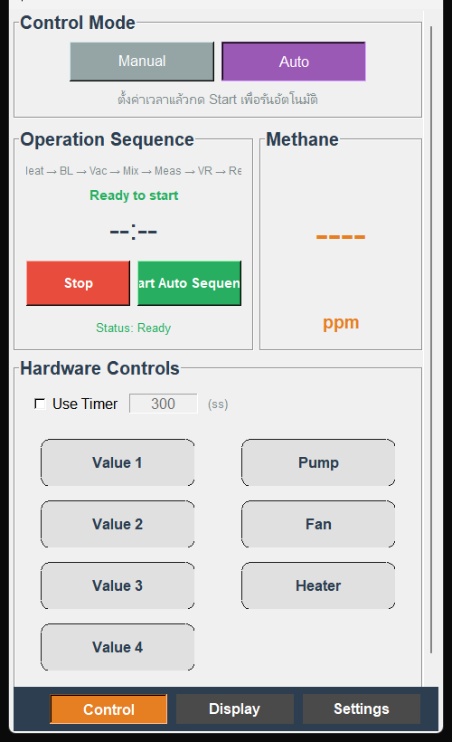{.fig-main}

*รูปที่ 1 — หน้า Control ในโหมด Auto แสดงแถบเลือกโหมด แผงสถานะลำดับขั้นตอน ปุ่ม Start/Stop และช่องแสดงค่า Methane*

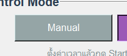{.fig-detail}

*รูปที่ 2 — ปุ่มสลับโหมด Manual / Auto*

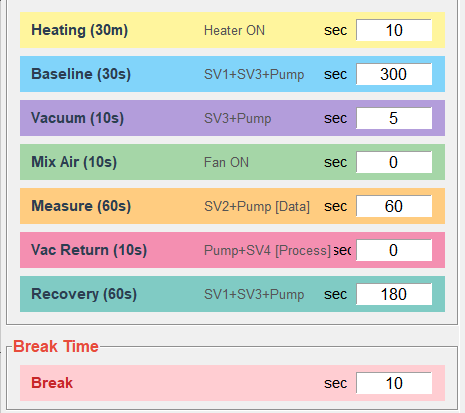{.fig-main}

*รูปที่ 3 — หน้า Settings: กำหนดระยะเวลาของแต่ละขั้น Op1–Op7 เป็นวินาที*

{.fig-main}

*รูปที่ 4 — กด Save Config หลังแก้ค่า เพื่อบันทึกลงไฟล์ `hardware_config.json`*

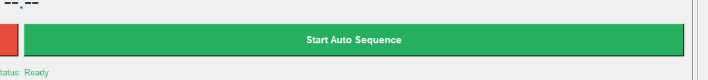{.fig-detail}

*รูปที่ 5 — ปุ่ม Start Auto Sequence*

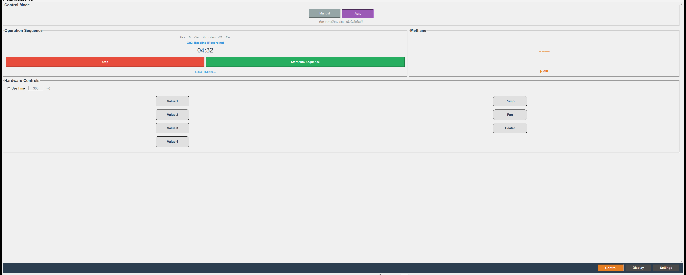{.fig-main}

*รูปที่ 6 — สถานะระหว่างวัด: ขั้นที่กำลังทำงาน สถานะ Recording และตัวนับเวลาถอยหลัง*

### 2.3 การอ่านสถานะบนหน้าจอ

บริเวณ Operation Sequence จะแสดงข้อมูล 3 ส่วนพร้อมกัน แถบ `Heat → BL → Vac → Mix → Meas → VR → Rec` แสดงลำดับ 7 ขั้นตอนทั้งหมด โดยขั้นที่กำลังทำงานจะถูกเน้นให้เห็นชัด ข้อความ เช่น `Op2: Baseline [Recording]` ระบุชื่อขั้นปัจจุบันและยืนยันว่าระบบกำลังบันทึกข้อมูลอยู่ และตัวเลขถอยหลังแสดงเวลาที่เหลือในขั้นนั้นเป็นวินาที

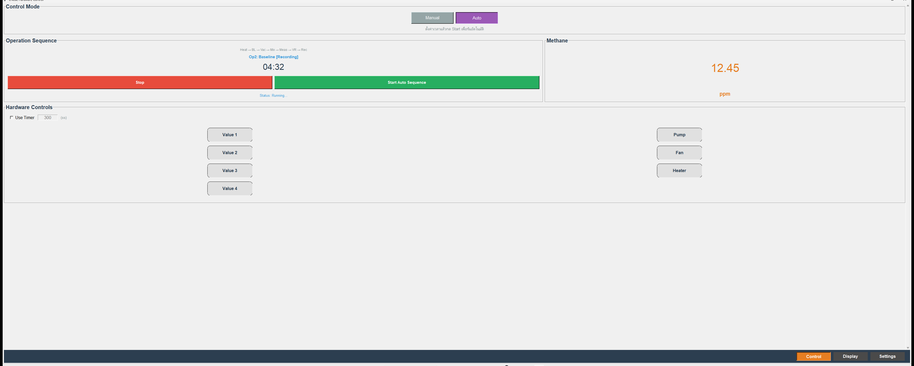{.fig-main}

*รูปที่ 7 — ผลลัพธ์หลังจบลำดับ Op1–Op7: ค่า Methane แสดงเป็น ppm*

### 2.4 การหยุดฉุกเฉิน

กดปุ่ม **Stop** (สีแดง) เมื่อจำเป็นต้องยกเลิกการวัดก่อนกำหนด ระบบจะหยุดลำดับขั้นตอน จากนั้นบันทึกและประมวลผลข้อมูลที่เก็บไว้จนถึงจุดนั้น ผลที่ได้อาจไม่ครบสมบูรณ์

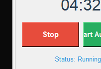{.fig-detail}

*รูปที่ 8 — ปุ่ม Stop ใช้ได้ทั้งในโหมด Auto และ Manual*

---

## 3. โครงสร้างหน้าจอ GUI

โปรแกรมแบ่งออกเป็น 3 หน้าหลัก สลับได้จากแถบนำทางที่ด้านล่างขวาของหน้าต่าง ได้แก่ **Control**, **Display** และ **Settings** กด **F11** เพื่อขยายหน้าต่างเต็มจอ และ **ESC** เพื่อออกจากโหมดเต็มจอ

### 3.1 หน้า Control

หน้า Control เป็นศูนย์กลางของการใช้งาน ประกอบด้วยส่วนสำคัญหลายส่วน แถบ **Manual / Auto** ใช้เลือกโหมดการทำงาน — Manual เหมาะสำหรับการทดสอบ hardware โดยตรง ส่วน Auto ใช้สำหรับการวัดมาตรฐาน แผง **Hardware Controls** แสดงสถานะของวาล์ว (Value 1–4), Pump, Fan และ Heater โดยสีเขียวหมายถึงเปิด ซึ่งในโหมด Auto จะถูกควบคุมโดยโปรแกรมโดยอัตโนมัติ ช่อง **Methane** จะแสดง `----` ตราบเท่าที่ยังไม่มีผล และเปลี่ยนเป็นตัวเลข ppm เมื่อโมเดล ML ประมวลผลเสร็จ

| องค์ประกอบ | หน้าที่ |
|------------|---------|
| Manual / Auto | สลับโหมดการวัด |
| Hardware Controls | สถานะ Value 1–4, Pump, Fan, Heater (สีเขียว = เปิด) |
| Operation Sequence | ขั้นปัจจุบัน เวลาถอยหลัง สถานะ Recording |
| Start / Stop | Auto: **Start Auto Sequence** · Manual: **Start Collection** |
| Methane | `----` = รอผล · ตัวเลข = ค่า ppm ประมาณจากโมเดล ML |

### 3.2 หน้า Display

หน้า Display ใช้ตรวจสอบผลการวัดหลังจบรอบ โดยแสดงกราฟ **Process Data** ของสัญญาณเซ็นเซอร์พร้อมค่า ppm หลังจากลำดับ Auto สิ้นสุดแล้ว ให้กด **Refresh Graph** เพื่อโหลดผลล่าสุดมาแสดง

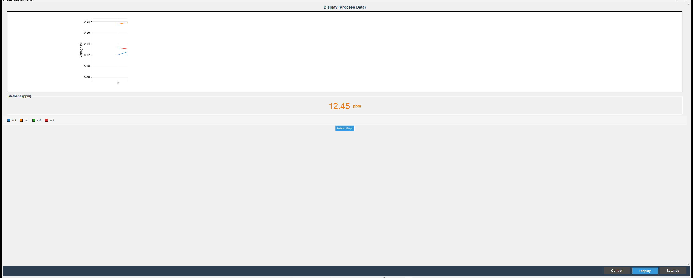{.fig-main}

*รูปที่ 9 — หน้า Display: กราฟสัญญาณเซ็นเซอร์และค่า ppm จากการประมวลผล*

### 3.3 หน้า Settings

หน้า Settings ใช้กำหนดพารามิเตอร์ทั้งหมดของรอบวัด ได้แก่ ระยะเวลาของ Op1–Op7, Break, Loop และการตั้งค่า Cloud Upload รายละเอียดแต่ละพารามิเตอร์อยู่ในหัวข้อ 4

{.fig-main}

*รูปที่ 10 — หน้า Settings แสดงพารามิเตอร์ครบทุกส่วน*

---

## 4. การตั้งค่า (Settings)

### 4.1 การแก้ไขและบันทึกค่า

ตั้งค่า **Parameter Source** เป็น **Input from UI** เพื่อให้แก้ไขค่าได้บนหน้าจอ จากนั้นกด **Save Config** เพื่อบันทึกลงไฟล์ `program/hardware_config.json` ทุกช่องเวลาใช้หน่วยเป็น **วินาที** และสามารถใส่ **0** เพื่อข้ามขั้นนั้นได้ สิ่งสำคัญที่ต้องทราบคือ **Heater** จะเปิดตั้งแต่เริ่ม Op1 และทำงานต่อเนื่องจนจบรอบวัด โดยไม่ขึ้นอยู่กับการตั้งค่าของขั้นอื่น

### 4.2 ลำดับขั้นตอน Op1–Op7

รอบวัดหนึ่งประกอบด้วย 7 ขั้นตอนต่อเนื่อง โดย Op1 Heating ทำหน้าที่อุ่นเซ็นเซอร์ให้ถึงอุณหภูมิทำงานโดยไม่มีการบันทึกข้อมูล Op2 Baseline เปิดวาล์ว V2, V3 และปั๊มเพื่ออ้างอิงสัญญาณพื้นฐาน และนี่คือจุดที่ระบบ**เริ่มบันทึกข้อมูล** ขั้น Op3–Op6 ดำเนินกระบวนการสูญญากาศ ผสมอากาศ นำตัวอย่างเข้าห้องวัด และดูดก๊าซกลับตามลำดับ โดยบันทึกข้อมูลต่อเนื่อง และขั้นสุดท้าย Op7 Recovery เมื่อสิ้นสุดแล้วระบบจะประมวลผลและคำนวณค่า ppm

| ขั้น | ชื่อ | อุปกรณ์เพิ่มเติม (นอกจาก Heater) | การบันทึกข้อมูล |
|------|------|--------------------------------------|-----------------|
| Op1 | Heating | — | ไม่บันทึก |
| Op2 | Baseline | V2, V3, Pump | **เริ่มบันทึก** |
| Op3 | Vacuum | V3, Pump | ต่อเนื่อง |
| Op4 | Mix Air | Fan | ต่อเนื่อง |
| Op5 | Measure | V1, V4, Pump | ต่อเนื่อง |
| Op6 | Vac Return | V4, Pump | ต่อเนื่อง |
| Op7 | Recovery | V2, V3 | ต่อเนื่อง → ประมวลผล |

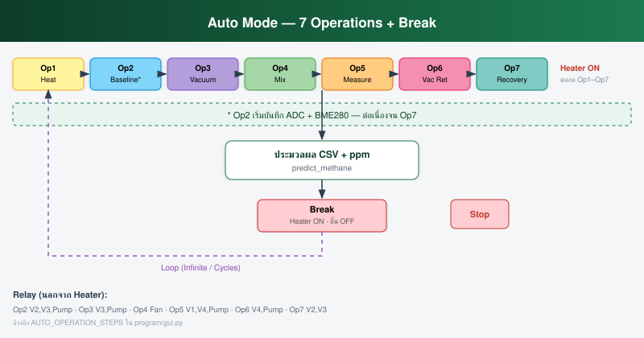{.fig-diagram}

*รูปที่ 11 — แผนภาพลำดับการทำงาน Op1–Op7 พร้อมอุปกรณ์ที่เปิดในแต่ละขั้น*

> **หมายเหตุ:** ข้อความย่อบนหน้า Settings (เช่น Baseline = SV1+SV3) อาจไม่ตรงกับ relay ที่ใช้จริง ให้อ้างอิงตารางด้านบนเป็นหลักเสมอ

### 4.3 Break, Loop และ Cloud

**Break** คือช่วงพักระหว่างรอบวัด ในช่วงนี้ Heater ยังคงเปิดเพื่อรักษาอุณหภูมิเซ็นเซอร์ แต่วาล์ว ปั๊ม และพัดลมจะปิดทั้งหมด **Loop** ให้เลือกระหว่าง Infinite Loop ซึ่งระบบจะวนวัดต่อเนื่องจนกว่าผู้ใช้จะกด Stop หรือกำหนดจำนวนรอบด้วยค่า Cycles **Cloud** เปิดใช้งาน Auto-upload ไปยัง Google Drive โดยอัตโนมัติหลังประมวลผล ซึ่งต้องตั้งค่าโดยผู้ดูแลระบบก่อน หากแสดง `Cloud: —` หมายความว่ายังไม่ได้ตั้งค่า แต่ข้อมูลยังคงบันทึกไว้ใน Pi ตามปกติ

{.fig-main}

*รูปที่ 12 — ส่วน Loop: Infinite Loop และการกำหนดจำนวน Cycles*

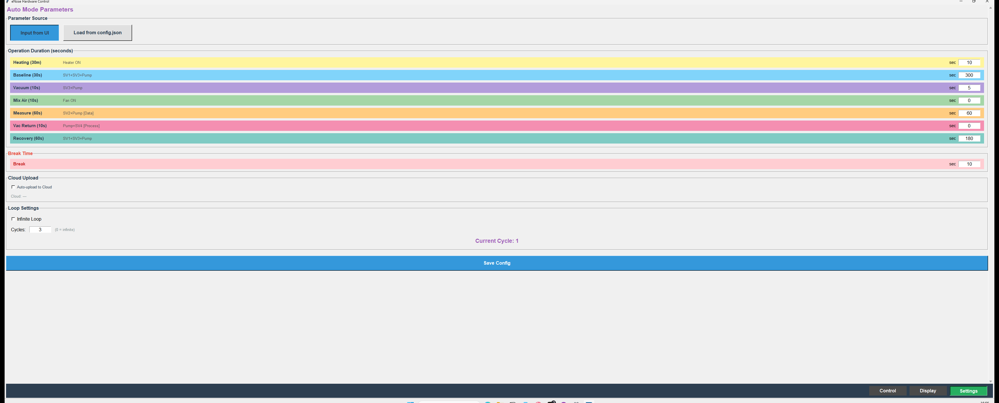{.fig-main}

*รูปที่ 13 — ส่วน Cloud: Auto-upload ไป Google Drive*

---

## 5. โหมด Manual

โหมด **Manual** ออกแบบมาสำหรับการทดสอบ hardware หรือดำเนินการขั้นตอนพิเศษที่อยู่นอกลำดับ Auto สำหรับการวัดมาตรฐานไม่แนะนำให้ใช้โหมดนี้ เนื่องจากผู้ใช้ต้องควบคุม relay แต่ละตัวด้วยตนเอง ซึ่งมีความเสี่ยงที่จะตั้งค่าลำดับผิดพลาดได้

การใช้งานโหมด Manual ทำได้โดยไปที่หน้า **Control** แล้วกด **Manual** จากนั้นคลิก Hardware Controls เพื่อเปิด-ปิด relay แต่ละตัว หรือจะติ๊ก **Use Timer** เพื่อให้ระบบจับเวลาให้ก็ได้ เมื่อพร้อมแล้วกด **Start Collection** เพื่อเริ่มบันทึกข้อมูล และกด **Stop** เมื่อเสร็จ

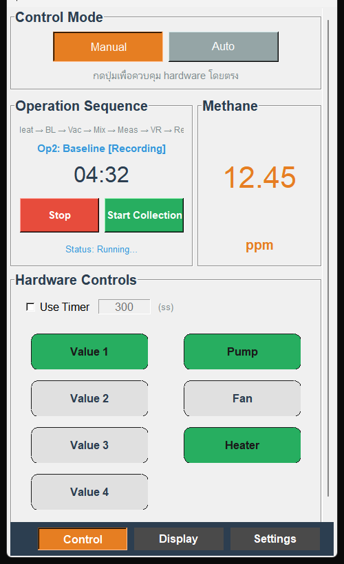{.fig-main}

*รูปที่ 14 — หน้า Control ในโหมด Manual: ควบคุมและดูสถานะ relay แต่ละตัวโดยตรง*

---

## 6. ผลลัพธ์และไฟล์ข้อมูล

### 6.1 ค่าที่แสดงบนหน้าจอ

เมื่อลำดับ Auto ยังดำเนินอยู่หรือโมเดลยังประมวลผลไม่เสร็จ ช่อง Methane จะแสดง `----` เมื่อการประมวลผลสมบูรณ์ ตัวเลข ppm จะปรากฏขึ้น โดยเป็นค่าความเข้มข้นมีเทนโดยประมาณจากโมเดล machine learning พึงทราบว่าค่านี้ **ไม่ใช่** ค่ามาตรฐานอ้างอิงทางกฎหมายหรือการรับรองจากหน่วยงานด้านความปลอดภัย

### 6.2 ไฟล์ที่ระบบสร้าง

ระบบบันทึกข้อมูลออกเป็น 2 รูปแบบ ข้อมูลดิบในรูปแบบ `.npz` เก็บที่โฟลเดอร์ `reading/data/` ประกอบด้วยสัญญาณ ADC ที่อ่านได้จากเซ็นเซอร์โดยตรง ส่วนข้อมูลหลังประมวลผลในรูปแบบ `.csv` เก็บที่ `acquisition/processed_data/` ซึ่งผ่านการแปลงสัญญาณและสกัด feature แล้ว พร้อมสำหรับการวิเคราะห์ต่อ

ในการนำข้อมูลออกจาก Pi สามารถทำได้ 3 วิธี ได้แก่ เปิดใช้งาน Cloud Upload ไป Google Drive (ต้องตั้งค่าโดยผู้ดูแลระบบก่อน) คัดลอกไฟล์ลง USB โดยตรง หรือใช้ SCP ผ่านเครือข่าย โปรดทราบว่า GUI ไม่มีปุ่ม Export ในตัว

---

## 7. การแก้ปัญหาเบื้องต้น

| อาการ | สาเหตุที่เป็นไปได้ | วิธีแก้ |
|-------|-------------------|---------|
| GUI ไม่เปิด | ไม่มี display หรือรันผ่าน SSH text-only | เข้าผ่านจอ Pi หรือ VNC ไป Desktop แล้วรัน `bash program/run_gui.sh` |
| ค่า ppm แสดง `----` | ลำดับยังไม่จบ หรือประมวลผลล้มเหลว | รอให้ครบ Op1–Op7 ตรวจสอบไฟล์ CSV ใน `processed_data/` และปรับเวลา Baseline/Measure |
| กราฟไม่แสดง | ยังไม่กด Refresh หรือ matplotlib ไม่ได้ติดตั้ง | กด Refresh Graph หลังจบรอบ และให้ผู้ดูแลระบบติดตั้ง matplotlib |
| ลำดับขั้นค้าง | ขั้น Heating ใช้เวลานาน หรือ hardware ไม่ตอบสนอง | สังเกตตัวนับเวลา ถ้าไม่เคลื่อนไหวเลยให้กด Stop แล้วตรวจ hardware |
| แสดง Cloud: — | ยังไม่ตั้งค่า Google Drive | ข้อมูลยังบันทึกใน Pi ปกติ ติดต่อผู้ดูแลระบบเพื่อตั้งค่า Drive |
| ไม่พบไฟล์ข้อมูล | ไม่ได้กด Start หรือปิด Pi ก่อนกด Stop | ต้องกด Start ก่อน Auto เริ่มบันทึกที่ Op2 และห้ามปิด Pi ก่อนกด Stop |

---

## คำศัพท์ใน GUI

| คำ | ความหมาย |
|----|----------|
| Value 1–4 | Solenoid Valve — วาล์วโซลินอยด์ควบคุมทิศทางกระแสก๊าซ |
| Pump | ปั๊มสูญญากาศ ใช้ดูดก๊าซผ่านระบบท่อ |
| Fan | พัดลม ใช้ผสมอากาศในห้องตัวอย่าง |
| Heater | ฮีตเตอร์ รักษาอุณหภูมิเซ็นเซอร์ให้คงที่ตลอดรอบวัด |
| ppm | parts per million — หน่วยวัดความเข้มข้นก๊าซในอากาศ |
| Op1–Op7 | ชื่อเรียกขั้นตอนแต่ละขั้นในลำดับ Auto Mode |
| Break | ช่วงพักระหว่างรอบ Heater ยังเปิด อุปกรณ์อื่นปิด |
| Baseline | ขั้นอ้างอิงสัญญาณพื้นฐาน ก่อนนำตัวอย่างก๊าซเข้าห้องวัด |
